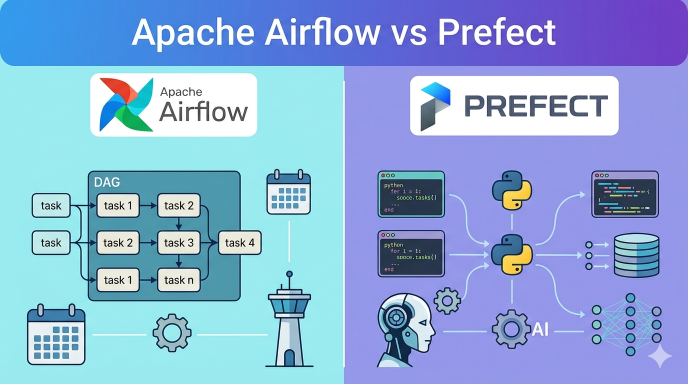

---
id: "airflow-vs-prefect"
title: "Airflow vs. Prefect: Architecture & Selection Guide for Data Teams"
description: "Choosing between Apache Airflow and Prefect is fundamentally a decision about execution paradigms and operational capacity. This guide breaks down the proven capabilities of both tools, with a specific focus on modern data stacks and AI orchestration."
published: "2026-04-01"
lang: "en-us"
type: "article"
tags: ["blog", "article"]
layout: "blog-detail.njk"
--- 

## 1. Core Execution Paradigms

* **Apache Airflow (Declarative & DAG-Centric):** Airflow requires defining the "what" and "how" upfront. Workflows are static Directed Acyclic Graphs (DAGs) locked in before execution. This strict blueprinting ensures predictability, rigid governance, and reliable time-based backfills for massive historical datasets.
* **Prefect (Imperative & Code-First):** Prefect treats orchestration as standard Python code. Workflows (`@flow`) and tasks (`@task`) build the execution graph dynamically at runtime. This allows pipelines to natively adapt, loop, and branch based on real-time data without framework-specific workarounds.

## 2. Technical Comparison Matrix

| Feature | Apache Airflow (3.x) | Prefect (3.x) | Startup / Data Team Impact |
| :--- | :--- | :--- | :--- |
| **Workflow Definition** | Instantiated DAG objects via Operators/Sensors. | Python functions decorated with `@flow` and `@task`. | Prefect offers a faster learning curve for Python developers; Airflow requires learning a specific framework DSL. |
| **Dynamic Behavior** | Originally static; 3.0 adds dynamic task mapping and event triggers. | Dynamic by design; graph builds based on runtime data. | Prefect naturally handles APIs returning unknown payload sizes; Airflow requires structural planning. |
| **Data Passing** | XComs (metadata database mechanism). | Native Python in-memory returns. | Prefect simplifies code and avoids metadata DB bottlenecks. |
| **Architecture** | Centralized (Scheduler, Webserver, Meta DB, Workers). | Hybrid Model (Control plane isolated from execution workers). | Airflow requires heavier infrastructure maintenance unless managed; Prefect is easier to self-host lightweight workers. |
| **Local Development** | Heavyweight (Requires full multi-service local instance). | Lightweight (Runs natively in IDEs or Jupyter notebooks). | Prefect allows for rapid local prototyping and ML experimentation. |

## 3. Orchestrating AI: LLMs and Agentic Workflows

AI workloads (RAG, agent loops, batch inference) introduce non-deterministic execution, expensive API calls, and state-based routing. 

**Airflow + AI: The Governed LLMOps Pipeline**
Airflow natively fits batch inference and RAG ingestion pipelines. By integrating the open-source **Airflow AI SDK** (built on Pydantic AI), data teams can use decorators like `@task.llm` and `@task.agent` to call language models and enforce structured output typing. Airflow 3.x also supports Human-in-the-Loop (HITL) operators, making it the superior choice if you need strict audit trails and manual approvals before an AI agent executes a sensitive downstream action.

**Prefect + AI: The Dynamic Agent Framework**
Prefect’s imperative architecture aligns perfectly with the reality of AI agents: they are state machines that use `while` loops, dynamic branching, and retries based on API rate limits. 
* **Cost Control:** Prefect automatically caches LLM results, preventing redundant API costs during iterative failures.
* **ControlFlow:** Prefect's open-source extension explicitly built for multi-agent orchestration, outputting Pydantic-validated results.
* **MCP Support:** Prefect Horizon provides a gateway and registry for Model Context Protocol (MCP) servers, allowing LLMs to securely interact with internal startup databases and APIs.

## 4. Decision Framework for Startups and Companies

**Choose Apache Airflow if:**
* **Workload:** Your primary use case is scheduled, batch-oriented ETL/ELT where complex historical backfilling is required.
* **Team Capacity:** You have dedicated platform engineers to manage a multi-service architecture, or budget for a managed service (e.g., Astronomer, Cloud Composer).
* **Compliance:** Your organization requires a strictly declarative, auditable pipeline blueprint that is mapped and approved *before* it runs.
* **Existing Stack:** You already rely on Airflow; extending it via the Airflow AI SDK is the lowest-friction path to production AI.

**Choose Prefect if:**
* **Workload:** Your pipelines are event-driven, or execution paths are heavily dependent on external API responses and dynamic data.
* **Developer Velocity:** Your team consists primarily of data scientists or Python developers who need to test flows locally in Jupyter/IDEs without infrastructure overhead.
* **AI Focus:** You are building non-deterministic agentic workflows. The combination of native Python control flow, LLM caching, and MCP integrations makes Prefect superior for unpredictable AI loops.
* **Lean Ops:** You want a hybrid deployment model—leveraging a managed cloud UI for orchestration while running lightweight execution workers in your own secure VPC.

***

### Sources
* [Apache Airflow 3.0 General Availability & Features](https://airflow.apache.org/blog/airflow-three-point-oh-is-here/)
* [Astronomer Airflow AI SDK Repository](https://github.com/astronomer/airflow-ai-sdk)
* [Prefect 3.0 Documentation & Hybrid Architecture](https://docs.prefect.io/v3/get-started)
* [Prefect ControlFlow Framework](https://github.com/PrefectHQ/ControlFlow) 
* [Pydantic AI Integration in Prefect](https://ai.pydantic.dev/durable_execution/prefect/)